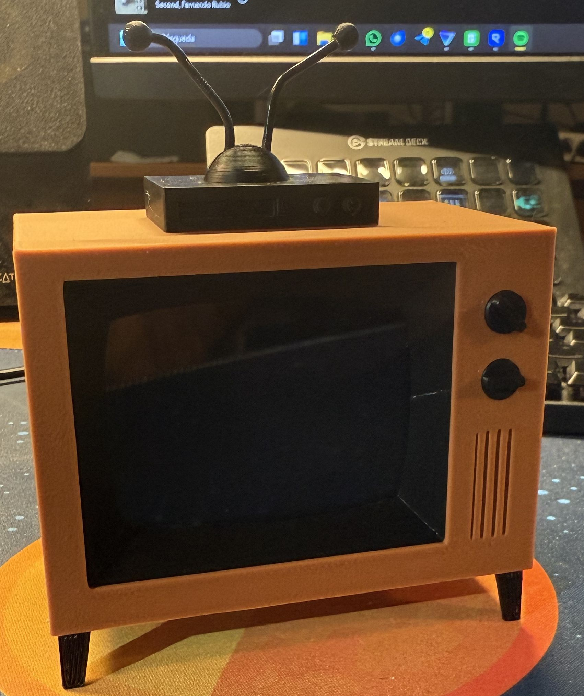

# 📺 Small Retro TV

This project is a modern take on the classic CRT TV, inspired by the [Simpsons TV](https://withrow.io/simpsons-tv-build-guide-waveshare) from Brandon Withrow. It plays random TV shows on a 3D-printed old CRT screen, bringing a touch of nostalgia to your living room.

**✨ Features:**
- 🎬 VLC-based video player with random playback
- 📱 Web-based WiFi configurator (no keyboard/monitor needed)
- 🌐 Video management UI (upload, delete, view videos)
- 📏 Automatic video scaling to 480px height
- 🔘 Physical button control (on/off and config mode)
- 🌐 Stream videos directly from URLs (YouTube, Vimeo, etc.) using yt-dlp
- 🔄 Automatic resume to local playback when stream ends



## 🛒 Shopping List
- [Raspberry Pi Zero W](https://www.amazon.es/RASPBERRY-PI-ZERO-Ordenador-Sobremesa/dp/B07BHMRTTY)
- [Waveshare 2.8inch for Raspberry Pi 480×640 dpi](https://www.amazon.es/dp/B08LZG5G19)
- [Adafruit Mono 2.5 W Audio Amplifier](https://www.amazon.es/dp/B07YJLNVVD)
- [1.5" 4ohm 3W Audio Speaker](https://www.amazon.es/dp/B01LN8ONG4)
- [Micro USB DIP Breakout Board](https://www.amazon.es/dp/B07WC8W81F)
- [Micro USB Cable to solder](https://www.amazon.es/dp/B0CWP1MCS9)
- [1K Trim Potentiometer](https://www.amazon.es/dp/B09S3FWWW7)
- [Micro Push Button Switch](https://www.amazon.es/dp/B07BFNKLKG)
- SD Card (enough disk space to store the OS and the videos)
- Cabling

## 🛠️ Steps to Build

### 1. Hardware Assembly
Follow [the original guide](https://withrow.io/simpsons-tv-build-guide-waveshare) to solder all the pieces together.

### 2. Prepare the SD Card
- Download [Raspberry Pi OS Lite (Legacy, Debian 11 Bullseye)](https://www.raspberrypi.com/software/operating-systems/) from the official Raspberry Pi website.
- Burn the image to the SD Card using [Raspberry Pi Imager](https://www.raspberrypi.com/software/).
- Configure WiFi and SSH access before first boot (optional):
  - Enable SSH by creating an empty file named `ssh` in the boot partition
  - Create `wpa_supplicant.conf` in the boot partition with your WiFi credentials (or use the web configurator after first boot)
- Insert the SD Card into the Raspberry Pi and power it on.

### 3. Initial Setup
- SSH into your Raspberry Pi (default credentials):
  ```
  user: pi
  password: raspberry
  ```
- Run `sudo raspi-config` to:
  - Expand filesystem
  - Change default password
  - Set locale/timezone
- Reboot after changes.

### 4. Configure the Display
- Unzip the [28DPI-DTBO.zip](./resources/28DPI-DTBO.zip) into `/etc/overlays`. More info [here](https://www.waveshare.com/wiki/2.8inch_DPI_LCD).
- Edit `/boot/config.txt` and add the following at the end:
  ```
  gpio=0-9=a2
  gpio=12-17=a2
  gpio=20-25=a2
  dtoverlay=dpi24
  enable_dpi_lcd=1
  display_default_lcd=1
  extra_transpose_buffer=2
  dpi_group=2
  dpi_mode=87
  dpi_output_format=0x7F216
  hdmi_timings=480 0 26 16 10 640 0 25 10 15 0 0 0 60 0 32000000 1
  dtoverlay=waveshare-28dpi-3b-4b
  dtoverlay=waveshare-28dpi-3b
  dtoverlay=waveshare-28dpi-4b
  dtoverlay=waveshare-touch-28dpi
  display_rotate=3
  disable_splash=1
  ```

### 5. Software Installation
- Update the system:
  ```bash
  sudo apt update && sudo apt upgrade -y
  ```
- Install dependencies:
  ```bash
  sudo apt install -y vlc python3-flask python3-rpi.gpio python3-pip ffmpeg
  ```
- Install yt-dlp (for streaming from URLs):
  ```bash
  # Download standalone binary (recommended, no Python version conflicts)
  sudo wget https://github.com/yt-dlp/yt-dlp/releases/latest/download/yt-dlp_linux_armv7l -O /usr/local/bin/yt-dlp
  sudo chmod +x /usr/local/bin/yt-dlp
  
  # Alternative: install via apt (older version)
  # sudo apt install -y yt-dlp
  ```
- Clone this repository:
  ```bash
  cd ~
  git clone https://github.com/YOUR_USERNAME/small_retro_tv.git
  cd small_retro_tv
  ```
- Install Python dependencies:
  ```bash
  pip3 install Flask Pillow werkzeug
  ```
- Create the videos directory:
  ```bash
  mkdir -p videos
  ```

### 6. Enable Audio
- Edit `/boot/config.txt` again and add:
  ```
  dtoverlay=audremap,enable_jack,pins_18_19
  ```
- Edit `/boot/cmdline.txt` and add the following (or edit if they exist):
  ```
  console=tty3 consoleblank=0 logo.nologo quiet splash
  ```

### 7. Configure GPIO for Audio
- Create the file `/etc/rc.local` with the following content:
  ```
  #!/bin/sh -e
  # This script is executed at the end of each multiuser runlevel

  raspi-gpio set 19 op a5

  exit 0
  ```

### 8. Create the System Service
- Create the file `/etc/systemd/system/tvplayer.service` with the following [content](./resources/tvplayer.service):
  ```
  [Unit]
  Description=RetroTV Player
  After=network.target

  [Service]
  WorkingDirectory=/home/pi/small_retro_tv/
  ExecStart=/usr/bin/python3 /home/pi/small_retro_tv/retrotv.py
  Restart=always
  User=pi

  [Install]
  WantedBy=multi-user.target
  ```
- Enable and start the service:
  ```bash
  sudo systemctl enable tvplayer.service
  sudo systemctl daemon-reload
  sudo systemctl start tvplayer.service
  ```

## 🎮 How to Use

### Normal Mode (Video Playback)
1. **Press the button** → TV turns on and starts playing random videos
2. **Release the button** → TV turns off
3. **Access web interface** → Open `http://<raspberry-pi-ip>` in your browser to:
   - **Stream from URL** (YouTube, Vimeo, etc.):
     * Paste any video URL in the blue section
     * Click "▶️ Reproducir" to start streaming
     * Video plays immediately at max 480p quality
     * Click "⏹️ Detener Stream" to stop and return to local videos
     * Stream auto-resumes local playback when finished
   - **Upload new videos** (automatically scaled to 480px height)
   - **Delete videos** from your library
   - **View video list** with size and duration info

### Configuration Mode (WiFi Setup)
1. **Hold the button while powering on** the Raspberry Pi
2. The screen will display:
   - SSID: `RetroTV`
   - Password: `RetroTV123`
   - IP address (usually `10.42.0.1`)
3. **Connect to the WiFi hotspot** from your phone/laptop
4. **Open browser** and go to `http://10.42.0.1`
5. **Configure your WiFi** network
6. **Release the button** → Raspberry Pi reboots and connects to your WiFi

## 🎉 Enjoy Your Retro TV!
Your retro TV is now ready to play random TV shows! The videos are automatically detected and reloaded every 5 seconds when changes are made through the web interface.

## 💡 Usage Examples

### Streaming from YouTube
1. Find a video on YouTube (e.g., classic cartoons, old TV shows)
2. Copy the URL: `https://www.youtube.com/watch?v=VIDEO_ID`
3. Open the web interface: `http://<raspberry-pi-ip>`
4. Paste the URL in the blue "Reproducir desde URL" section
5. Click "▶️ Reproducir"
6. The video plays immediately on your RetroTV

### Supported Streaming Sites
Thanks to yt-dlp, you can stream from 1000+ websites including:
- **YouTube** - `https://www.youtube.com/watch?v=...`
- **Vimeo** - `https://vimeo.com/...`
- **Dailymotion** - `https://www.dailymotion.com/video/...`
- **Twitch** (VODs) - `https://www.twitch.tv/videos/...`
- And many more! See [full list](https://github.com/yt-dlp/yt-dlp/blob/master/supportedsites.md)

### Managing Local Videos
1. **Upload**: Click "Subir Nuevo Video" → Select file → Automatic conversion to 480p MP4
2. **Delete**: Click 🗑️ next to any video to remove it
3. **Auto-reload**: New videos are detected within 5 seconds during playback

## 📋 Technical Details

### Video Processing
- **Automatic scaling**: Videos are automatically scaled to maximum 480px height
- **Format conversion**: All videos are converted to MP4 (H.264 baseline, AAC audio)
- **Optimization**: Videos are optimized for Raspberry Pi playback with `libx264` codec
- **Supported formats**: MP4, AVI, MKV, MOV, WebM, FLV, WMV

### URL Streaming
- **yt-dlp integration**: Extracts direct video URLs from YouTube, Vimeo, and 1000+ sites
- **Automatic quality selection**: Streams at max 480p (optimal for display)
- **No storage required**: Direct streaming without downloading
- **Smart resume**: Auto-returns to local playback when stream ends
- **Command used**: `yt-dlp -f "best[height<=480]/best" -g URL | cvlc ...`

### System Architecture
- **Python 3** with Flask web framework
- **VLC (cvlc)** for video playback with random loop mode
- **yt-dlp** for URL streaming and video extraction
- **FFmpeg/FFprobe** for video processing and metadata extraction
- **GPIO control** via RPi.GPIO library
- **Background monitoring** for automatic video list updates
- **Threaded streaming** for non-blocking URL playback

### Network Services
- **Port 80** (HTTP) - Web interface for video management (normal mode)
- **Port 80** (HTTP) - WiFi configuration interface (config mode)
- **WiFi Hotspot** - Temporary AP for initial setup (`RetroTV` / `RetroTV123`)

### Streaming Considerations
- **Network required**: Streaming needs active internet connection
- **Quality**: Automatically limited to 480p for optimal performance
- **Buffering**: May occur depending on network speed
- **Duration**: Stream URLs from YouTube expire after 6-12 hours
- **Local fallback**: System returns to local videos when stream ends

## 🔧 Troubleshooting

### Screen not working
- Verify `/boot/config.txt` has all the display settings
- Check that overlays are properly installed in `/etc/overlays`

### No audio
- Verify audio configuration in `/boot/config.txt`
- Check GPIO 19 is set correctly in `/etc/rc.local`

### Videos not playing
- Ensure videos are in the `videos/` directory
- Check VLC is installed: `which cvlc`
- Check FFmpeg is installed: `which ffmpeg`
- View logs: `sudo journalctl -u tvplayer.service -f`

### Web interface not accessible
- Check service status: `sudo systemctl status tvplayer.service`
- Verify Flask dependencies: `pip3 list | grep -i flask`
- Check network connectivity: `ip addr show`

### Streaming not working
- Verify yt-dlp is installed: `which yt-dlp`
- Test yt-dlp manually: `yt-dlp -f "best[height<=480]" -g "https://www.youtube.com/watch?v=VIDEO_ID"`
- Update yt-dlp: `sudo yt-dlp -U` (if installed via pip) or re-download binary
- Check if URL is supported: Visit [yt-dlp supported sites](https://github.com/yt-dlp/yt-dlp/blob/master/supportedsites.md)
- View streaming logs: `sudo journalctl -u tvplayer.service -f | grep -i stream`
