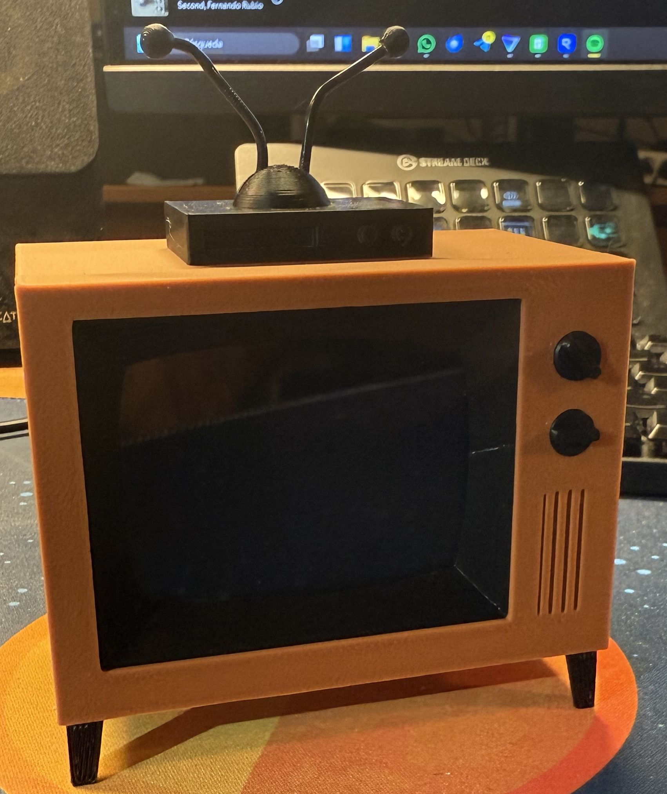

# 📺 Small Retro TV

This project is a modern take on the classic CRT TV, inspired by the [Simpsons TV](https://withrow.io/simpsons-tv-build-guide-waveshare) from Brandon Withrow. It plays random TV shows on a 3D-printed old CRT screen, bringing a touch of nostalgia to your living room.



## 🛒 Shopping List
- [Raspberry Pi Zero W](https://www.amazon.es/RASPBERRY-PI-ZERO-Ordenador-Sobremesa/dp/B07BHMRTTY)
- [Waveshare 2.8inch for Raspberry Pi 480×640 dpi](https://www.amazon.es/dp/B08LZG5G19)
- [Adafruit Mono 2.5 W Audio Amplifier](https://www.amazon.es/dp/B07YJLNVVD)
- [1.5" 4ohm 3W Audio Speaker](https://www.amazon.es/dp/B01LN8ONG4)
- [Micro USB DIP Breakout Board](https://www.amazon.es/dp/B07WC8W81F)
- [Micro USB Cable to solder](https://www.amazon.es/dp/B0CWP1MCS9)
- [1K Trim Potentiometer](https://www.amazon.es/dp/B09S3FWWW7)
- [Micro Push Button Switch](https://www.amazon.es/dp/B07BFNKLKG)
- SD Card (enough disk space to store the OS and the videos)
- Cabling

## 🛠️ Steps to Build

### 1. Hardware Assembly
Follow [the original guide](https://withrow.io/simpsons-tv-build-guide-waveshare) to solder all the pieces together.

### 2. Prepare the SD Card
- Download the [pipaOS](https://web.archive.org/web/20210519025137/https://pipaos.mitako.eu/download/) from Archive.org.
- Burn the ISO to the SD Card using [Raspberry Pi Imager](https://www.raspberrypi.com/software/).
- Edit `wpa_supplicant.conf` and configure it with your WiFi settings. Insert the SD Card into the Raspberry Pi and power it on.

### 3. Initial Setup
- SSH into your Raspberry Pi:
  ```
  user: sysop
  password: posys
  ```
- Run `sudo pipaos-config`, expand the filesystem, and reboot.
- Run `sudo pipaos-config` again to change the password.

### 4. Configure the Display
- Unzip the [28DPI-DTBO.zip](./resources/28DPI-DTBO.zip) into `/etc/overlays`. More info [here](https://www.waveshare.com/wiki/2.8inch_DPI_LCD).
- Edit `/boot/config.txt` and add the following at the end:
  ```
  gpio=0-9=a2
  gpio=12-17=a2
  gpio=20-25=a2
  dtoverlay=dpi24
  enable_dpi_lcd=1
  display_default_lcd=1
  extra_transpose_buffer=2
  dpi_group=2
  dpi_mode=87
  dpi_output_format=0x7F216
  hdmi_timings=480 0 26 16 10 640 0 25 10 15 0 0 0 60 0 32000000 1
  dtoverlay=waveshare-28dpi-3b-4b
  dtoverlay=waveshare-28dpi-3b
  dtoverlay=waveshare-28dpi-4b
  dtoverlay=waveshare-touch-28dpi
  display_rotate=3
  disable_splash=1
  ```

### 5. Software Installation
- Update the sources list:
  ```
  sudo nano /etc/apt/sources.list
  ```
  Replace the line with:
  ```
  deb http://legacy.raspbian.org/raspbian stretch main contrib non-free
  ```
- Install dependencies:
  ```
  sudo apt update
  sudo apt install usbmount raspi-gpio omxplayer
  ```
- Clone this repository to get all necessary files.

### 6. Enable Audio
- Edit `/boot/config.txt` again and add:
  ```
  dtoverlay=audremap,enable_jack,pins_18_19
  ```
- Edit `/boot/cmdline.txt` and add the following (or edit if they exist):
  ```
  console=tty3 consoleblank=0 logo.nologo quiet splash
  ```

### 7. Configure GPIO for Audio
- Create the file `/etc/rc.local` with the following content:
  ```
  #!/bin/sh -e
  # This script is executed at the end of each multiuser runlevel

  raspi-gpio set 19 op a5

  exit 0
  ```

### 8. Create the System Service
- Create the file `/etc/systemd/system/tvplayer.service` with the following [content](./resources/tvplayer.service):
  ```
  [Unit]
  Description=tvplayer
  After=network.target

  [Service]
  WorkingDirectory=/home/sysop/small_retro_tv/
  ExecStart=/usr/bin/python /home/sysop/small_retro_tv/retrotv.py
  Restart=always

  [Install]
  WantedBy=multi-user.target
  ```
- Enable and start the service:
  ```
  sudo systemctl enable tvplayer.service
  sudo systemctl daemon-reload
  sudo systemctl start tvplayer.service
  ```

## 🎉 Enjoy Your Retro TV!
Your retro TV is now ready to play random TV shows! Sit back, relax, and enjoy the nostalgia.
